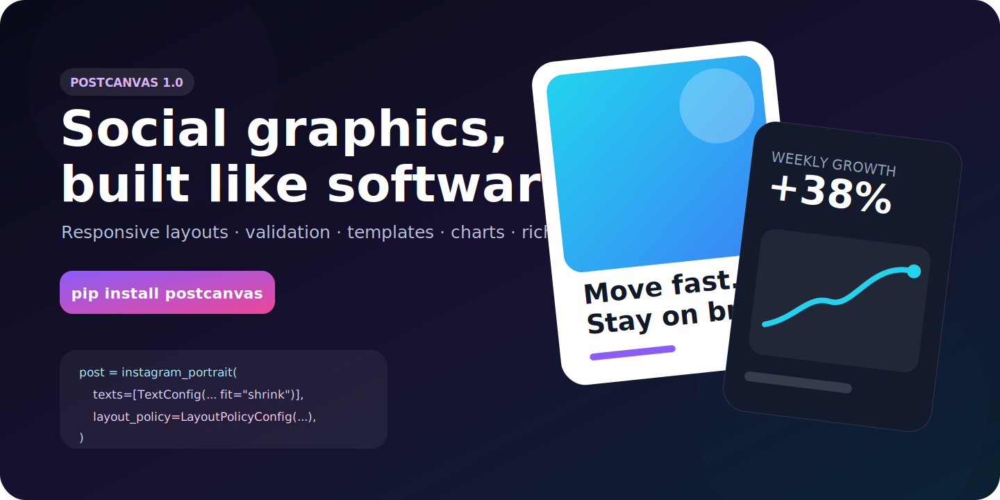
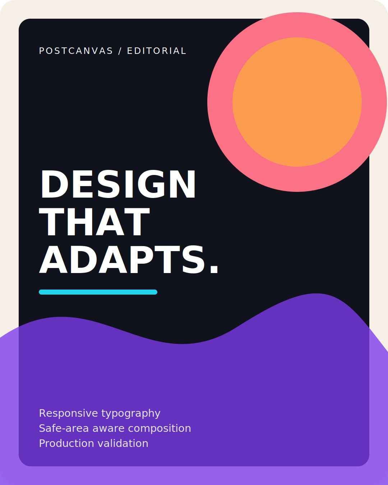
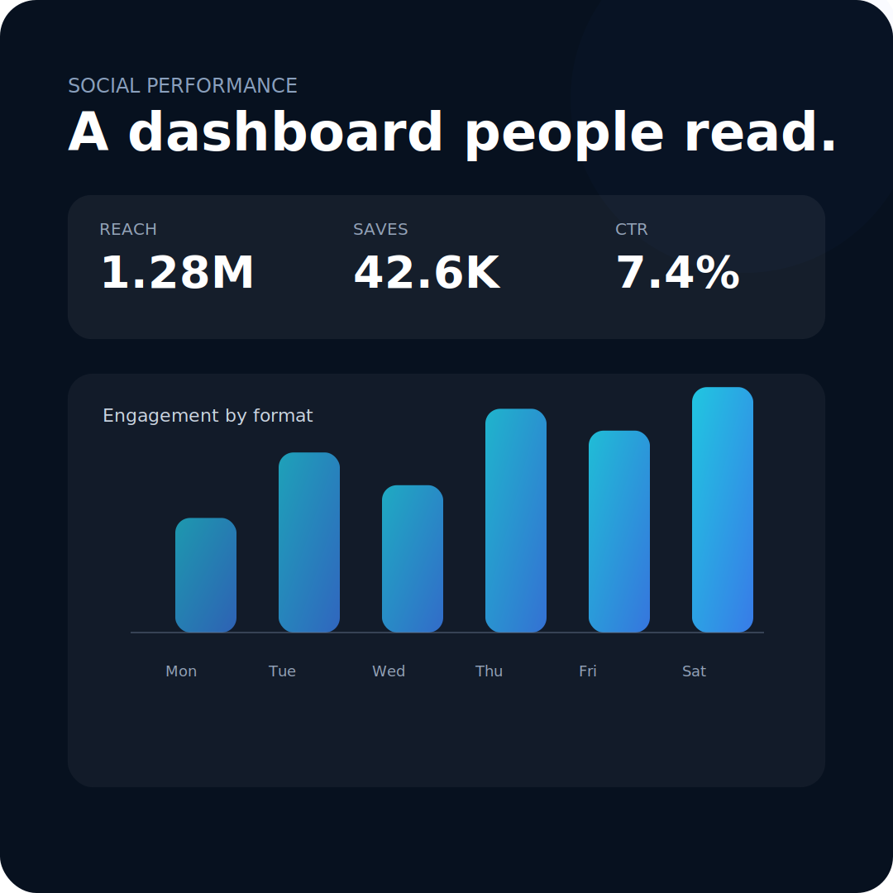
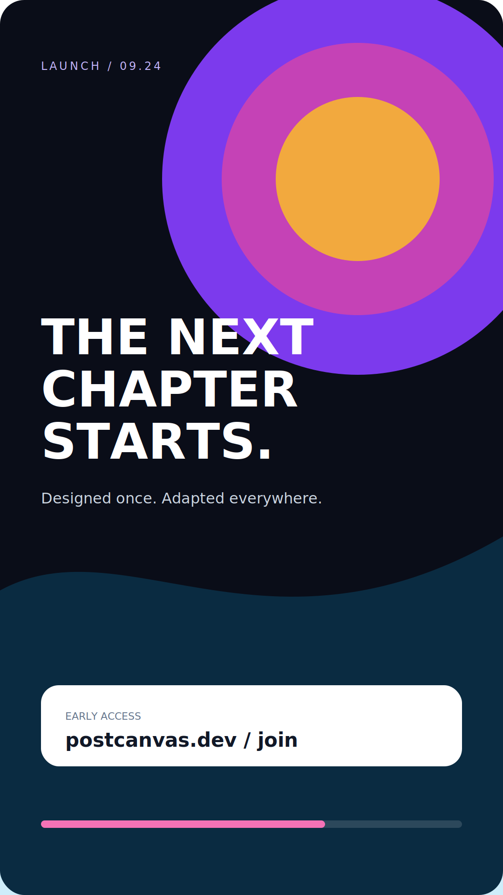
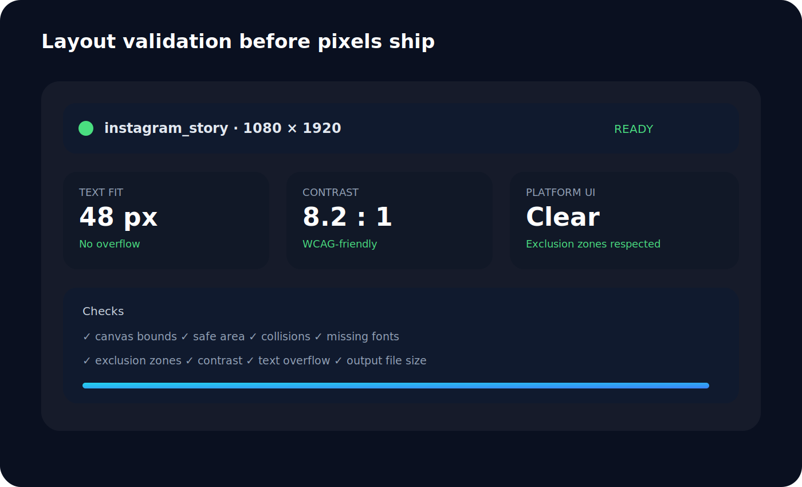
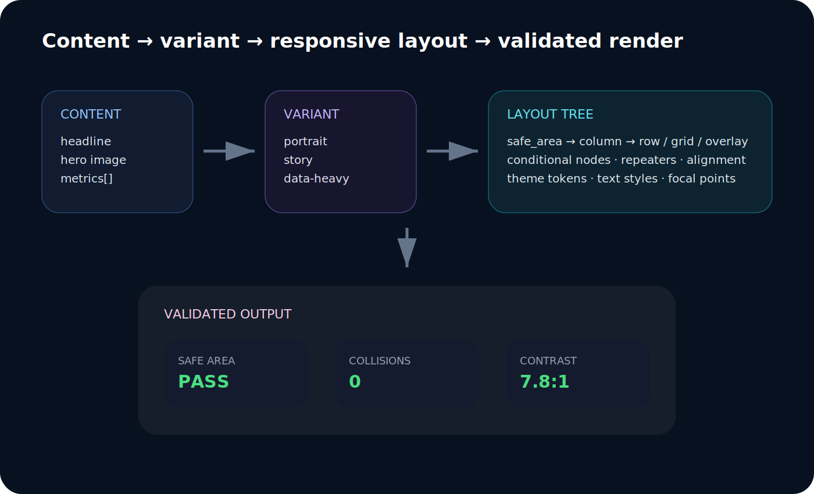

<p align="center">
  
</p>

<h1 align="center">postcanvas</h1>

<p align="center">
  Generate responsive, validated, brand-consistent social graphics from Python.
</p>

<p align="center">
  <a href="https://pypi.org/project/postcanvas/"></a>
  
  
  
</p>

Postcanvas is a declarative rendering engine for social-media images, launch graphics, carousels, dashboards, thumbnails, Open Graph images, and reusable content templates. It combines Pillow rendering with Pydantic models, responsive layout primitives, platform profiles, and preflight validation.

```bash
pip install postcanvas
```

For YAML templates and dictionary hyphenation:

```bash
pip install "postcanvas[yaml,typography]"
```

## Why postcanvas

Most image-generation scripts are a pile of coordinates. Postcanvas treats graphics as a system:

- **Responsive typography** that wraps, balances, shrinks, truncates, clips, preserves paragraphs, supports RTL/CJK/emoji, and detects overflow.
- **Reusable template trees** with rows, columns, grids, overlays, alignment, conditionals, repeaters, safe-area containers, inheritance, fixtures, and theme tokens.
- **Production validation** for collisions, bounds, safe areas, platform UI zones, contrast, missing fonts, text overflow, and output file size.
- **Rich visual primitives** including gradients, images, focal-point crops, shapes, nested text, filters, blend modes, shadows, tables, and charts.
- **Multi-platform output** through built-in profiles for Instagram, TikTok, LinkedIn, X, YouTube, Facebook, Reddit, blogs, and custom canvases.
- **Automation-friendly results** as paths, PIL images, bytes, detailed reports, or reusable serialized templates.

## Gallery

<table>
<tr>
<td width="50%"></td>
<td width="50%"></td>
</tr>
<tr>
<td width="50%"></td>
<td width="50%"></td>
</tr>
</table>

<p align="center">
  
</p>

See the [full gallery and source map](docs/gallery.md).

## Quick start

```python
from postcanvas import render
from postcanvas.models import (
    BackgroundConfig,
    GradientConfig,
    GradientStop,
    LayoutPolicyConfig,
    TextConfig,
)
from postcanvas.presets import instagram_portrait

post = instagram_portrait(
    background=BackgroundConfig(
        gradient=GradientConfig(
            type="linear",
            angle=135,
            stops=[
                GradientStop(color="#090b17", position=0),
                GradientStop(color="#25113f", position=0.55),
                GradientStop(color="#0c2f3d", position=1),
            ],
        )
    ),
    layout_policy=LayoutPolicyConfig(
        collision="error",
        canvas_bounds="error",
        safe_area="error",
        exclusion_zones="error",
        text_overflow="error",
        contrast="warn",
    ),
    texts=[
        TextConfig(
            id="headline",
            collision_group="content",
            content="Design once.\nAdapt everywhere.",
            x="8%",
            y="18%",
            width="84%",
            height="34%",
            anchor="topleft",
            font_size=108,
            min_font_size=42,
            max_lines=4,
            fit="shrink",
            overflow="ellipsis",
            wrap_mode="balanced",
            align="left",
            color="#FFFFFF",
        ),
        TextConfig(
            id="caption",
            collision_group="content",
            content="Responsive social graphics from Python.",
            x="8%",
            y="78%",
            width="72%",
            height="10%",
            anchor="topleft",
            font_size=34,
            min_font_size=24,
            fit="shrink",
            color="#C4B5FD",
        ),
    ],
)

result = render(post)
result.images[0].save("portrait.png")
print(result.reports[0].issues)
```

`render()` always returns images, paths, and validation reports. `generate()` preserves the simpler legacy return contract.

## Capability overview

| Area | Highlights |
|---|---|
| Typography | bounded text, shrink-to-fit, balanced wrapping, ellipsis, clipping, paragraphs, widow control, transforms, decorations, auto contrast, font fallback, variable fonts, RTL/CJK/emoji |
| Rich text | independently styled spans, mixed font scales, backgrounds, stroke, shadow, decoration, indentation, hyphenation |
| Layout | absolute/percentage dimensions, anchors, z-index, rows, columns, grids, overlays, groups, alignment, conditionals, repeaters, aspect ratios |
| Media | local or remote images, cover/contain/fill/center, manual or automatic focal points, borders, radius, filters, brightness, contrast, saturation |
| Drawing | rectangles, rounded rectangles, circles, ellipses, lines, triangles, polygons, stars, gradients, shadows, nested text |
| Data | styled tables, per-column/per-cell alignment, grouped bar charts, line charts, legends, labels and palettes |
| Templates | variants, inheritance, required slots, content thresholds, theme tokens, JSON/YAML, preview fixtures, assisted selection |
| Validation | collisions, canvas bounds, safe areas, UI exclusion zones, text overflow, contrast, fonts, file-size limits |
| Output | PNG/JPEG/WebP, carousels, PIL images, bytes, cloud pipelines, metadata, watermarks, filters |
| Platforms | Instagram, TikTok, LinkedIn, X, Facebook, YouTube, Reddit, blog/Open Graph, custom profiles |

## Documentation index

### Start here

- [Documentation home](docs/README.md)
- [Getting started](docs/getting-started.md)
- [Core concepts](docs/concepts.md)
- [Examples cookbook](docs/examples.md)
- [Gallery](docs/gallery.md)

### Design and rendering

- [Typography](docs/typography.md)
- [Rich text](docs/rich-text.md)
- [Backgrounds and images](docs/backgrounds-images.md)
- [Shapes, effects and compositing](docs/shapes-effects.md)
- [Tables and charts](docs/tables-charts.md)
- [Carousels and multi-canvas posts](docs/carousels.md)

### Systems and production

- [Templates and responsive layout](docs/templates.md)
- [Validation and accessibility](docs/validation.md)
- [Platform profiles](docs/platform-profiles.md)
- [Output, bytes and cloud storage](docs/output-cloud.md)
- [Assisted variant selection](docs/assisted-selection.md)
- [Renderer architecture](docs/renderer-architecture.md)

### Reference

- [Configuration reference](docs/config-reference.md)
- [API reference](docs/api-reference.md)
- [Migration to 1.0](docs/migration-1.0.md)
- [Example source directory](examples/README.md)

## Minimal APIs

### Render with reports

```python
from postcanvas import render

result = render(post, save=False)
image = result.images[0]
warnings = result.warnings
```

### Generate files

```python
from postcanvas import generate

paths = generate(post)
```

### Return raw images

```python
images = generate(post, save=False, return_images=True)
```

### Return both paths and images

```python
result = generate(post, save=True, return_images=True)
print(result.paths)
print(result.images)
print(result.reports)
```

### Convert to bytes

```python
from postcanvas import image_to_bytes
from postcanvas.models import OutputFormat

payload = image_to_bytes(result.images[0], format=OutputFormat.WEBP, quality=90)
```

## Built-in sizes

```python
from postcanvas.presets import list_profiles

for profile in list_profiles():
    print(profile.name, profile.width, profile.height)
```

Common helpers include:

- `instagram_post()`
- `instagram_portrait()`
- `instagram_story()`
- `instagram_reel_cover()`
- `tiktok_story()`
- `linkedin_post()`
- `x_post()` and `x_banner()`
- `youtube_thumbnail()` and `youtube_banner()`
- `facebook_post()`
- `reddit_post()`
- `blog_og()` and `blog_cover()`

Profiles can include safe-area insets, platform UI exclusion zones, crop metadata, recommended formats, and file-size limits.

<p align="center">
  
</p>

## Template example

```python
from postcanvas import LayoutNode, Template, TemplateVariant, Theme

template = Template(
    name="launch-system",
    theme=Theme(
        colors={
            "text": "#FFFFFF",
            "accent": "#A78BFA",
            "surface": "#111827",
        },
        spacing={"sm": 16, "md": 32, "lg": 56},
        text_styles={
            "display": {
                "font_size": 104,
                "min_font_size": 40,
                "fit": "shrink",
                "wrap_mode": "balanced",
            }
        },
    ),
    variants={
        "portrait": TemplateVariant(
            profile="instagram_portrait",
            required_slots=["headline"],
            root=LayoutNode(
                kind="column",
                gap="md",
                children=[
                    LayoutNode(
                        kind="text",
                        name="eyebrow",
                        basis=54,
                        color="#C4B5FD",
                    ),
                    LayoutNode(
                        kind="text",
                        name="headline",
                        grow=2,
                        text_style="display",
                        max_lines=4,
                    ),
                    LayoutNode(
                        kind="image",
                        name="hero",
                        grow=3,
                        image_fit="cover",
                        focal_mode="auto",
                        border_radius=30,
                    ),
                    LayoutNode(
                        kind="text",
                        name="cta",
                        basis=86,
                        background_color="#FFFFFF",
                        color="#111827",
                    ),
                ],
            ),
        )
    },
)

result = template.render(
    {
        "eyebrow": "POSTCANVAS 1.0",
        "headline": "A content system that scales.",
        "hero": "assets/product.jpg",
        "cta": "Read the launch notes →",
    }
)
```

<p align="center">
  
</p>

## Examples

The [`examples/`](examples/) directory includes complete scripts for:

- editorial posters and launch graphics
- responsive rich text
- analytics dashboards
- multi-slide carousels
- reusable templates and repeaters
- platform packs
- validation reports
- cloud and byte-output workflows

Run an example from the repository root:

```bash
python examples/editorial_poster.py
```

## Stability policy

Version 1.0 marks the public configuration, rendering, template, validation, and output APIs as stable. New features should be additive. Breaking model or behavior changes require a new major release and migration notes.

## License

MIT
