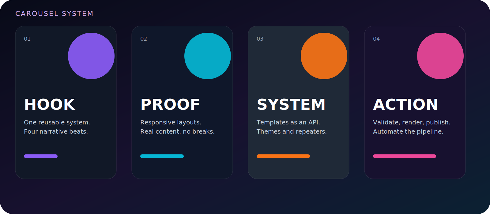

# Carousels and multi-canvas posts

A post renders one image when `canvases` is empty. When canvases are present, each canvas becomes a slide.

## Basic carousel

```python
from postcanvas import generate
from postcanvas.models import BackgroundConfig, CanvasConfig, TextConfig
from postcanvas.presets import instagram_post

post = instagram_post(
    text_font_family="Inter",
    canvases=[
        CanvasConfig(
            background=BackgroundConfig(color="#111827"),
            output_filename="01-hook",
            texts=[
                TextConfig(
                    content="The hook",
                    width="84%",
                    height="34%",
                    fit="shrink",
                    font_size=96,
                )
            ],
        ),
        CanvasConfig(
            background=BackgroundConfig(color="#312E81"),
            output_filename="02-proof",
            texts=[
                TextConfig(
                    content="The proof",
                    width="84%",
                    height="34%",
                    fit="shrink",
                    font_size=96,
                )
            ],
        ),
    ],
)

paths = generate(post)
```

## Global elements

Post-level elements are merged into every slide by default.

```python
post.texts = [
    TextConfig(
        content="@brand",
        x="7%",
        y="94%",
        anchor="bottomleft",
        font_size=24,
        opacity=0.7,
    )
]
```

## Replace elements

Use `replace_elements=True` to prevent global element merging.

```python
CanvasConfig(
    replace_elements=True,
    texts=[...],
    images=[...],
)
```

## Slide overrides

A canvas can override dimensions, background, padding and safe area, exclusion zones, file-size limit, layout policy, font defaults, elements, filters, watermark, output filename, and metadata.

## Consistent narrative systems

A practical carousel often uses hook, context, evidence, process, and action. Use shared post-level decoration, a consistent type scale, and per-slide content.

<p align="center">
  
</p>

## Template-driven carousels

Render a template multiple times with different content or variants and combine the resulting configurations into `CanvasConfig` values. For a typed content pipeline, store each slide payload in a list and generate canvases in a loop.

## Output naming

```python
CanvasConfig(output_filename=f"{index:02d}-{slug}")
```

## Validation

Every slide has its own `LayoutReport`. File-size validation also uses slide-level limits when configured.
