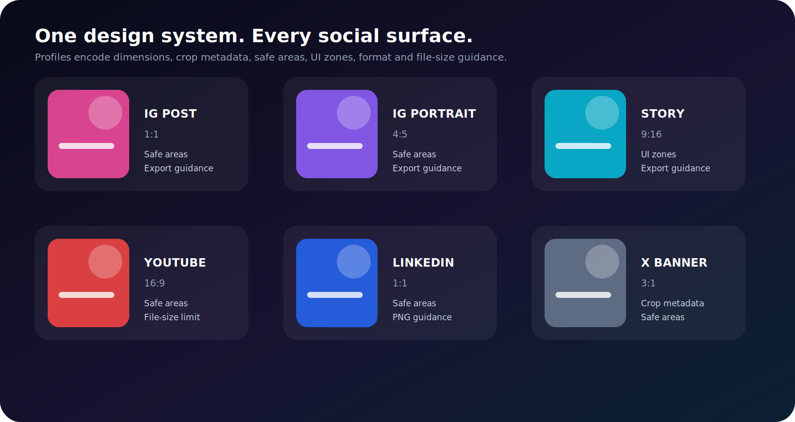

# Platform profiles

A platform profile describes a target surface, not merely a canvas size. Profiles can include dimensions, safe-area insets, platform UI exclusion zones, crop dimensions, recommended output format, maximum file size, and a description.

<p align="center">
  
</p>

## List profiles

```python
from postcanvas.presets import list_profiles

for profile in list_profiles():
    print(profile.name)
    print(profile.width, profile.height)
    print(profile.safe_area)
    print(profile.exclusion_zones)
```

## Get one profile

```python
from postcanvas.presets import get_profile

profile = get_profile("instagram_story")
```

## Built-in helpers

```python
from postcanvas.presets import (
    blog_cover,
    blog_og,
    facebook_post,
    instagram_portrait,
    instagram_post,
    instagram_reel_cover,
    instagram_story,
    linkedin_post,
    reddit_post,
    tiktok_story,
    x_banner,
    x_post,
    youtube_banner,
    youtube_thumbnail,
)
```

The exact registry is available through `list_profiles()`.

## Apply a profile through a preset

```python
post = instagram_story(texts=[...], images=[...])
```

Preset helpers return a normal `PostConfig`; all fields remain editable.

## Inspect safe areas

```python
profile = get_profile("instagram_story")

content_width = profile.width - profile.safe_area.left - profile.safe_area.right
content_height = profile.height - profile.safe_area.top - profile.safe_area.bottom
```

## Exclusion zones

```python
for zone in profile.exclusion_zones:
    print(zone.name, zone.description)
```

These represent areas where platform interface elements, titles, controls, avatars, or crop variations may obscure content.

## Crop metadata

Some surfaces render a full upload but crop it in other contexts. `crop_width` and `crop_height` describe the expected visible crop guidance available for that profile.

## Export guidance

```python
post.output_format = profile.recommended_format
post.max_file_size_bytes = profile.max_file_size_bytes
```

Preset helpers may apply this automatically.

## Custom canvases

```python
from postcanvas.models import (
    ExclusionZone,
    LayoutPolicyConfig,
    OutputFormat,
    PaddingConfig,
    Platform,
    PostConfig,
    PostFormat,
)

post = PostConfig(
    platform=Platform.CUSTOM,
    format=PostFormat.CUSTOM,
    profile_name="conference-screen",
    width=3840,
    height=2160,
    safe_area=PaddingConfig.symmetric(vertical=120, horizontal=180),
    exclusion_zones=[
        ExclusionZone(
            name="ticker",
            x=0,
            y="90%",
            width="100%",
            height="10%",
        )
    ],
    output_format=OutputFormat.PNG,
    layout_policy=LayoutPolicyConfig(
        safe_area="error",
        exclusion_zones="error",
    ),
)
```

## Profile maintenance

Platform interfaces change. Treat safe areas and exclusion zones as conservative guidance, validate current publishing requirements, and version custom profiles when distribution rules change.
